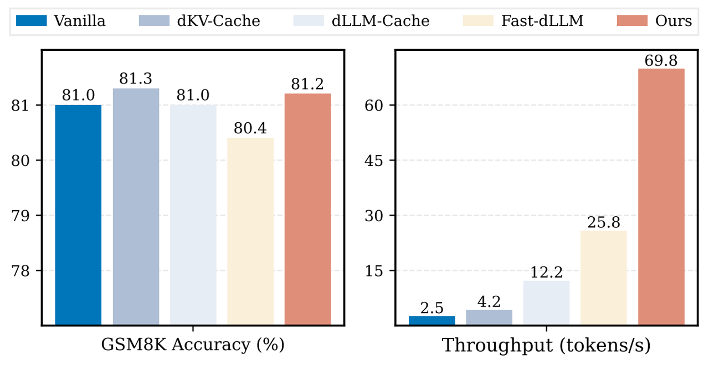
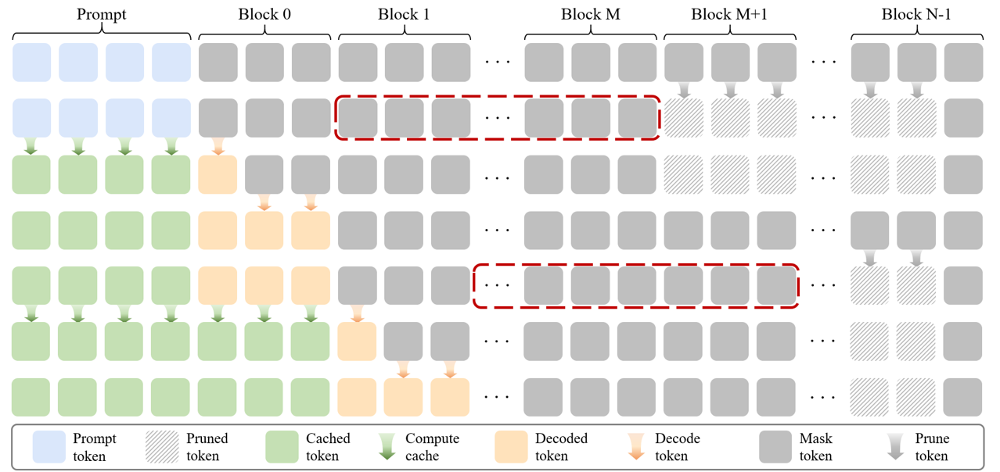

# Streaming-dLLM: Accelerating Diffusion LLMs via Suffix Pruning and Dynamic Decoding

[](https://github.com/xiaoshideta/Streaming-dLLM)
[](https://arxiv.org/pdf/2601.17917)

## Introduction
Streaming-dLLM is a training-free acceleration framework for diffusion language models that supports efficient inference for models like Dream, LLaDA and LLaDA-1.5.

<div align="center">
  
  <p>Comparison of accuracy and throughput across different acceleration strategies. Our proposed method improves inference throughput while maintaining competitive accuracy compared to prior approaches.</p>
</div>

<div align="center">
  
  <p>Illustration of approximated suffix pruning. For each block, the nearest neighboring region following the current block is retained using a sliding window (red dashed box) and concatenated with the trailing position to form an approximate suffix region.</p>
</div>

## Installation
1. Clone this repo.
```
$ git clone https://github.com/xiaoshideta/Streaming-dLLM.git
$ cd Streaming-dLLM-main
```

2. Install all dependencies.
```
$ conda create -n stream-dllm python=3.10.19
$ pip install -r requirements.txt
$ conda activate stream-dllm
```

## Project Structure
Your project structure should look like this:
```shell
|-- <Dream>
|-- <LLaDA-1.5>
|-- <Other>
```
## Usage
### Model Weights

Download the Dream model [here](https://huggingface.co/Dream-org/Dream-v0-Base-7B/tree/main).

Download the LLaDA model [here](https://huggingface.co/GSAI-ML/LLaDA-8B-Instruct).

Download the LLaDA-1.5 model [here](https://huggingface.co/GSAI-ML/LLaDA-1.5).


### Dream
```shell
cd Dream
bash eval_dream.sh
```

### LLaDA-1.5
```shell
cd LLaDA-1.5
bash eval_llada.sh
```

### LLaDA
Please first replace the `llada-1.5` path with `llada`, and then execute the same script.

```shell
bash eval_llada.sh
```

### Performance
Our method achieves **3.7×–13.3× speedup** across all benchmarks over the vanilla backbone. Compared with the state-of-the-art acceleration method, it provides **1.5×–2.3× additional speedup** on tasks with a generation length of 512. Meanwhile, our accuracy is **comparable or slightly better**, which demonstrates the effectiveness of our approach.

| Benchmark              | Gen Length | Dream                 | dKV-Cache            | Prefix-Cache            | Fast-dLLM               | Ours                     |
| ---------------------- | ---------- | --------------------- | -------------------- | ----------------------- | ----------------------- | ------------------------ |
| **HumanEval (0-shot)** | 256        | 49.4<br>20.4 (1×)     | 48.2*<br>21.5 (1.1×) | *53.7*<br>32.0 (1.6×)   | **54.3**<br>53.7 (2.6×) | **54.3**<br>74.7 (3.7×)  |
|                        | 512        | 54.3<br>13.7 (1×)     | 49.4*<br>15.7 (1.1×) | **54.9**<br>24.2 (1.8×) | 54.3<br>40.2 (2.9×)     | *54.6*<br>72.3 (5.3×)    |
| **GSM8K-CoT (5-shot)** | 256        | **74.8***<br>9.0 (1×) | 73.6*<br>17.0 (1.9×) | *74.0**<br>31.5 (3.5×)  | 73.5*<br>47.9 (5.3×)    | *74.0*<br>75.5 (8.4×)    |
|                        | 512        | *74.2**<br>7.1 (1×)   | 71.6*<br>12.8 (1.8×) | *74.2**<br>23.6 (3.3×)  | 74.1*<br>41.7 (5.9×)    | **74.7**<br>94.1 (13.3×) |
| **MBPP (3-shot)**      | 256        | **56.6**<br>11.0 (1×) | 54.0*<br>14.7 (1.3×) | 53.2<br>32.3 (2.9×)     | *56.4*<br>67.2 (6.1×)   | *56.4*<br>80.2 (7.3×)    |
|                        | 512        | *55.6*<br>8.7 (1×)    | 53.0*<br>11.6 (1.3×) | 53.8<br>24.5 (2.8×)     | 55.2<br>63.1 (7.3×)     | **55.8**<br>92.4 (10.6×) |
| **MATH (4-shot)**      | 256        | **38.4**<br>10.5 (1×) | 36.8*<br>14.6 (1.4×) | 36.8<br>32.5 (3.1×)     | *37.6*<br>62.6 (6.0×)   | *37.6*<br>78.4 (7.5×)    |
|                        | 512        | **39.8**<br>8.6 (1×)  | 38.5*<br>11.6 (1.3×) | 38.0<br>24.5 (2.8×)     | 39.3<br>54.4 (6.3×)     | *39.4*<br>96.0 (11.2×)   |


| Benchmark              | Gen Length | LLaDA-1.5             | dKV-Cache               | Prefix-Cache         | Fast-dLLM             | Ours                     |
| ---------------------- | ---------- | --------------------- | ----------------------- | -------------------- | --------------------- | ------------------------ |
| **HumanEval (0-shot)** | 256        | **43.9***<br>6.4 (1×) | *40.2**<br>6.6 (1.0×)   | 38.4*<br>10.9 (1.7×) | 37.2*<br>19.1 (3.0×)  | 39.0<br>34.1 (5.3×)      |
|                        | 512        | **40.5***<br>2.9 (1×) | *40.2**<br>3.3 (1.1×)   | 37.8*<br>4.8 (1.7×)  | 39.8*<br>13.6 (4.7×)  | *40.2*<br>26.7 (9.2×)    |
| **GSM8K (5-shot)**     | 256        | 80.5*<br>6.3 (1×)     | *80.7**<br>10.8 (1.7×)  | 80.6*<br>24.4 (3.9×) | *80.7*<br>50.0 (7.9×) | **80.8**<br>66.2 (10.5×) |
|                        | 512        | 81.0*<br>2.5 (1×)     | **81.3***<br>4.2 (1.7×) | 81.0*<br>8.2 (3.3×)  | 80.4<br>25.8 (10.3×)  | *81.2*<br>69.8 (28.0×)   |
| **MBPP (3-shot)**      | 256        | *38.0**<br>2.2 (1×)   | **38.2***<br>3.5 (1.6×) | 37.8*<br>7.6 (3.5×)  | 37.6*<br>29.5 (13.4×) | 37.8<br>54.7 (24.9×)     |
|                        | 512        | *38.2**<br>0.9 (1×)   | 38.1*<br>1.5 (1.7×)     | 38.0*<br>2.8 (3.1×)  | 38.1*<br>16.5 (18.3×) | **38.4**<br>61.4 (68.2×) |
| **MATH (4-shot)**      | 256        | *32.7**<br>7.8 (1×)   | 31.8*<br>12.4 (1.6×)    | 32.5*<br>25.9 (3.3×) | 32.6<br>47.1 (6.0×)   | **33.7**<br>66.2 (8.5×)  |
|                        | 512        | **37.1***<br>4.8 (1×) | *35.1**<br>7.5 (1.6×)   | 35.0*<br>13.9 (2.9×) | *35.1*<br>38.3 (7.9×) | *35.1*<br>62.4 (13.0×)   |


## Citation

If you find this work useful, please cite our paper:

```bibtex
@misc{xiao2026streamingdllmacceleratingdiffusionllms,
      title={Streaming-dLLM: Accelerating Diffusion LLMs via Suffix Pruning and Dynamic Decoding}, 
      author={Zhongyu Xiao and Zhiwei Hao and Jianyuan Guo and Yong Luo and Jia Liu and Jie Xu and Han Hu},
      year={2026},
      eprint={2601.17917},
      archivePrefix={arXiv},
      primaryClass={cs.LG},
      url={https://arxiv.org/abs/2601.17917}, 
}
```

## Acknowledgements

Part of our code is based on [Fast-dLLM](https://github.com/NVlabs/Fast-dLLM), [LLaDA](https://github.com/llada-project/llada) and [Dream](https://github.com/dream-project/dream),  thanks for their excellent work!

